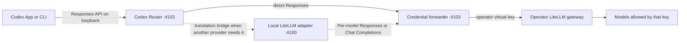

# Connect your own LiteLLM gateway

[English](LITELLM-GATEWAY.md) | [Русский](LITELLM-GATEWAY.ru.md)

This guide covers the `litellm-gateway` provider: a portable connection from
Codex Router to an OpenAI-compatible LiteLLM deployment controlled by the
operator. The repository includes no shared endpoint, virtual key, or model
allowlist.

## What runs where

Codex Router runs on the user's Mac, Windows PC, or Linux machine. It does not
install anything on the LiteLLM server and does not require changes to the
Codex source code.



Responses-native models from **Your LiteLLM Gateway** go directly to the
gateway's Responses endpoint. Chat Completions models use the local adapter,
which preserves Codex tool and history translation. The Router starts that
adapter whenever any selected model requires it, then uses each model's
declared OpenAI-compatible surface there.
The credential forwarder removes Codex and ChatGPT identity headers, injects
only the selected LiteLLM virtual key, and sends the request to the saved
upstream URL. Native GPT models bypass this external route and continue to use
Codex normally.

## Interactive installation

Run the guided installer and select **Your LiteLLM Gateway**.

macOS or Linux:

```sh
./install.sh --target codex --guided
```

Windows PowerShell:

```powershell
powershell.exe -NoProfile -ExecutionPolicy Bypass -File .\install.ps1 -Target codex -Guided -Providers litellm-gateway
```

The provider argument skips the general provider menu but does not supply an
endpoint. The operator still enters both values locally. No deployment-specific
gateway URL is embedded in the public installer.

The installer asks for these values in order:

1. **OpenAI-compatible base URL** — visible input, for example
   `https://gateway.example/v1`. Press Enter to accept the current value. The
   local LiteLLM default is `http://127.0.0.1:4000/v1`.
2. **LiteLLM virtual key** — hidden input. The key is never accepted as a
   command argument and is not printed after entry. Windows shows neither
   characters nor asterisks after paste; right-click, Shift+Insert, or
   Ctrl+Shift+V in Windows Terminal, then press Enter.

During installation/startup, the router automatically discovers models that
the saved virtual key may use and publishes new IDs with conservative local
metadata. Reliable `max_input_tokens` and `max_output_tokens` returned by
LiteLLM are cached and applied to every checked-in, manual, and auto-curated
model for this provider. The input limit becomes the Codex context window and
the auto-compaction threshold is 85%; 131072 is only the fallback when no valid
live input limit exists. These commands remain useful for inspection, manual metadata, and
route corrections:

```sh
./bin/model-router codex discover-models litellm-gateway
./bin/model-router codex curate-models litellm-gateway
./bin/model-router codex doctor
```

On Windows, use the same commands through the PowerShell wrapper:

```powershell
.\model-router.cmd codex discover-models litellm-gateway
.\model-router.cmd codex curate-models litellm-gateway
.\model-router.cmd codex doctor
```

If you chose a custom installation directory, change into that managed checkout
instead of the default path shown above.

Fully quit and reopen Codex after curation so it reloads the generated model
catalog.

Chat Completions is the safe default for this generic provider; the checked-in
trusted `codex-gpt-` prefix selects Responses automatically. If another
LiteLLM alias requires the Responses endpoint, set its route explicitly:

```sh
./bin/curate-models litellm-gateway --models MODEL_ID --api-surface responses --apply
```

This also updates an existing auto-curated entry without erasing its manually
edited metadata. Use `--api-surface chat-completions` to switch it back.

## Local state and precedence

The checked-in provider definition supplies only a safe loopback default.
Machine-specific values live under the current user's Codex state directory,
normally `~/.codex/codex-router` on macOS/Linux and
`%USERPROFILE%\.codex\codex-router` on Windows.

| Value | Storage | Protection | Runtime precedence |
| --- | --- | --- | --- |
| Gateway URL | `provider-endpoints.json` | mode `600` or current-user Windows ACL | environment, saved value, registry default |
| Virtual key | `litellm-gateway-api-key.secret` | mode `600` or current-user Windows ACL | environment, protected file, compatible Keychain item |
| Curated models | `user-models.json` | mode `600` or current-user Windows ACL | merged with the checked-in registry |
| Enabled providers | `enabled-providers.json` | protected per-user state | read for every routed request |

`CODEX_ROUTER_LITELLM_BASE_URL` and `CODEX_ROUTER_LITELLM_API_KEY` are useful
for temporary foreground testing. Environment-only values are not assumed to
reach launchd, systemd, or Windows Task Scheduler; use the interactive commands
for a persistent installation.

Change or inspect the connection without reinstalling:

```sh
./bin/model-router codex provider-endpoint litellm-gateway status
./bin/model-router codex provider-endpoint litellm-gateway set
./bin/model-router codex provider-key litellm-gateway status
./bin/model-router codex provider-key litellm-gateway set
```

The forwarder resolves the saved URL and key on each request, so rotations take
effect without restarting the service. Codex needs a restart only when its
model picker catalog changes.

## LiteLLM-side policy

Create a dedicated virtual key for each person or machine. Restrict it to the
required model aliases and set a small budget, requests-per-minute limit, and
parallel-request limit. Never distribute the LiteLLM master key or an
administrator key.

The router's `/models` discovery sees only what the supplied key and gateway
return. `litellm-gateway` is explicitly opted in as a trusted, operator-owned
provider, so it checks the live catalog during installation/startup and every
five minutes. Background discovery deliberately uses the saved restricted key,
not an environment-only override.

New IDs are appended to protected `user-models.json` with text-only,
131072-token, high-effort defaults and no unverified vision, search,
reasoning-summary, or `apply_patch` capability. For this trusted, opted-in
provider, a successfully parsed live `/models` snapshot is authoritative only
for entries marked `autoCurated: true`: absent IDs are removed from that local
overlay. Existing manual entries and checked-in registry models always win.
A discovery or publication failure, non-2xx response, or invalid model list
keeps the last usable routes and picker catalog.

When new IDs are added, the supervisor restarts only the local router stack and
publishes gateway routes before the picker catalog. If that sequence is
interrupted, a durable pending marker makes the next startup retry it. Codex
Desktop still needs a full quit and reopen to load the changed picker catalog.
Set `MODEL_ROUTER_AUTO_CURATE_INTERVAL_MS=0` to disable periodic checks, or set
an integer of at least `60000` milliseconds to change the interval. Startup
discovery and manual curation remain available.

Changing the saved virtual-key file or saved gateway endpoint while the
supervisor is running schedules one debounced immediate discovery, then uses
the normal pending-marker/restart publication path if the catalog changed. The
watcher filters to only those two files; an unavailable or failed filesystem
watcher leaves the running service and catalog unchanged, with periodic
discovery still available as the fallback.

## Updating, rollback, and branches

`main` is the portable distribution for all users. It must contain no personal
gateway URL, credential, or organization-only model definition. A personal
beta with private provider metadata must live in a separate private repository;
GitHub repository visibility applies to every branch, so a private branch
inside a public repository is not private.

Fully quit the Codex or ChatGPT desktop app before updating. CLI-only users
should finish or stop active tasks first.

macOS and Linux (default managed checkout):

```sh
cd "${XDG_DATA_HOME:-$HOME/.local/share}/codex-router"
./bin/model-router codex update
./bin/model-router codex doctor
```

Windows PowerShell, run as the same user who runs ChatGPT/Codex (not as
Administrator):

```powershell
Set-Location "$env:LOCALAPPDATA\codex-router"
.\model-router.cmd codex update
.\model-router.cmd codex doctor
```

If `doctor` reports `FAIL`, run `./bin/model-router codex doctor --fix` on
macOS/Linux or `.\model-router.cmd codex doctor --fix` on Windows.

If the update does not pass its install gates, the updater restores the prior
revision. An operator can also run `./bin/rollback` (or
`.\model-router.cmd codex rollback` on Windows) while the retained revision is
available. Update and repair run the same transactional publication order as
installation. If generation, service startup, or health verification fails,
the previous managed files and service definition are restored. Fully reopen
Codex/ChatGPT and create a new task after a successful update so the app reloads
the model catalog and subagent definitions. A source archive without `.git`
cannot use the updater; download a newer tagged release or rerun the public
guided installer.

## Verification and troubleshooting

Start with:

```sh
./bin/model-router codex provider-endpoint litellm-gateway status
./bin/model-router codex provider-key litellm-gateway status
./bin/model-router codex discover-models litellm-gateway
./bin/model-router codex doctor
```

- A `401` usually means the virtual key is wrong, expired, or not accepted by
  that LiteLLM gateway.
- A `403` usually means the key exists but lacks access to the chosen model.
- An empty picker after a successful connection means startup discovery did
  not publish models yet; inspect `discover-models`, run `curate-models` if
  needed, and reopen Codex.
- A connection failure usually means the saved URL is unreachable from the
  user's computer or lacks the OpenAI-compatible `/v1` prefix expected by the
  deployment.
- A model that answers text but fails tools should not be promoted to native
  multi-agent v2 until the compatibility probe proves tool use.

Create a local diagnostic bundle with `./bin/support-bundle`. Saved custom
gateway URLs and credentials are redacted, logs are excluded by default, and
the bundle is never uploaded automatically. Inspect it before sharing.

## Platform support boundary

The Node test suite and installer syntax run through the local verification
gate. Windows CI parses the real PowerShell installer and wrapper. A real
colleague install remains the release acceptance test for Windows-specific
Codex Desktop behavior, firewall policy, and access to the operator's actual
LiteLLM gateway.
