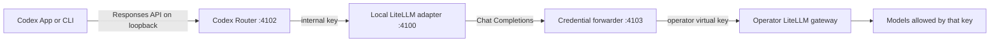

# Connect your own LiteLLM gateway

[English](LITELLM-GATEWAY.md) | [Русский](LITELLM-GATEWAY.ru.md)

This guide covers the `litellm-gateway` provider: a portable connection from
Codex Router to an OpenAI-compatible LiteLLM deployment controlled by the
operator. The repository includes no shared endpoint, virtual key, or model
allowlist.

## What runs where

Codex Router runs on the user's Mac, Windows PC, or Linux machine. It does not
install anything on the LiteLLM server and does not require changes to the
Codex source code.



The local adapter converts Codex Responses requests and streams into the
OpenAI-compatible Chat Completions contract. The credential forwarder removes
Codex and ChatGPT identity headers, injects only the selected LiteLLM virtual
key, and sends the request to the saved upstream URL. Native GPT models bypass
this route and continue to use Codex normally.

## Interactive installation

Run the guided installer and select **Your LiteLLM Gateway**.

macOS or Linux:

```sh
./install.sh --target codex --guided
```

Windows PowerShell:

```powershell
./install.ps1 -Target codex -Guided
```

The installer asks for these values in order:

1. **OpenAI-compatible base URL** — visible input, for example
   `https://gateway.example/v1`. Press Enter to accept the current value. The
   local LiteLLM default is `http://127.0.0.1:4000/v1`.
2. **LiteLLM virtual key** — hidden input. The key is never accepted as a
   command argument and is not printed after entry.

After installation, discover and curate the models that the virtual key may
use:

```sh
./bin/model-router codex discover-models litellm-gateway
./bin/model-router codex curate-models litellm-gateway
./bin/model-router codex doctor
```

On Windows, use the same commands through the PowerShell wrapper:

```powershell
./model-router.ps1 codex discover-models litellm-gateway
./model-router.ps1 codex curate-models litellm-gateway
./model-router.ps1 codex doctor
```

Fully quit and reopen Codex after curation so it reloads the generated model
catalog.

## Local state and precedence

The checked-in provider definition supplies only a safe loopback default.
Machine-specific values live under the current user's Codex state directory,
normally `~/.codex/codex-router` on macOS/Linux and
`%USERPROFILE%\.codex\codex-router` on Windows.

| Value | Storage | Protection | Runtime precedence |
| --- | --- | --- | --- |
| Gateway URL | `provider-endpoints.json` | mode `600` or current-user Windows ACL | environment, saved value, registry default |
| Virtual key | `litellm-gateway-api-key.secret` | mode `600` or current-user Windows ACL | environment, protected file, compatible Keychain item |
| Curated models | `user-models.json` | mode `600` or current-user Windows ACL | merged with the checked-in registry |
| Enabled providers | `enabled-providers.json` | protected per-user state | read for every routed request |

`CODEX_ROUTER_LITELLM_BASE_URL` and `CODEX_ROUTER_LITELLM_API_KEY` are useful
for temporary foreground testing. Environment-only values are not assumed to
reach launchd, systemd, or Windows Task Scheduler; use the interactive commands
for a persistent installation.

Change or inspect the connection without reinstalling:

```sh
./bin/model-router codex provider-endpoint litellm-gateway status
./bin/model-router codex provider-endpoint litellm-gateway set
./bin/model-router codex provider-key litellm-gateway status
./bin/model-router codex provider-key litellm-gateway set
```

The forwarder resolves the saved URL and key on each request, so rotations take
effect without restarting the service. Codex needs a restart only when its
model picker catalog changes.

## LiteLLM-side policy

Create a dedicated virtual key for each person or machine. Restrict it to the
required model aliases and set a small budget, requests-per-minute limit, and
parallel-request limit. Never distribute the LiteLLM master key or an
administrator key.

The router's `/models` discovery sees only what the supplied key and gateway
return. Curation is local and explicit: discovering a model does not publish it
to the picker, and a model curated on one computer does not silently appear on
another.

## Updating, rollback, and branches

`main` is the portable distribution for all users. It must contain no personal
gateway URL, credential, or organization-only model definition. A personal
beta with private provider metadata must live in a separate private repository;
GitHub repository visibility applies to every branch, so a private branch
inside a public repository is not private.

Update the installed checkout with:

```sh
./bin/model-router codex update
./bin/model-router codex doctor
```

If the update does not pass its install gates, the updater restores the prior
revision. An operator can also run `./bin/rollback` (or
`./codex-router.ps1 rollback` on Windows) while the retained revision is
available.

## Verification and troubleshooting

Start with:

```sh
./bin/model-router codex provider-endpoint litellm-gateway status
./bin/model-router codex provider-key litellm-gateway status
./bin/model-router codex discover-models litellm-gateway
./bin/model-router codex doctor
```

- A `401` usually means the virtual key is wrong, expired, or not accepted by
  that LiteLLM gateway.
- A `403` usually means the key exists but lacks access to the chosen model.
- An empty picker after a successful connection means no models have been
  curated yet; run `curate-models` and reopen Codex.
- A connection failure usually means the saved URL is unreachable from the
  user's computer or lacks the OpenAI-compatible `/v1` prefix expected by the
  deployment.
- A model that answers text but fails tools should not be promoted to native
  multi-agent v2 until the compatibility probe proves tool use.

Create a local diagnostic bundle with `./bin/support-bundle`. Saved custom
gateway URLs and credentials are redacted, logs are excluded by default, and
the bundle is never uploaded automatically. Inspect it before sharing.

## Platform support boundary

The Node test suite and installer syntax run in CI on macOS, Ubuntu, and
Windows. Windows CI also parses the real PowerShell installer and wrapper and
builds the desktop tray binary. A real colleague install remains the release
acceptance test for Windows-specific Codex Desktop behavior, firewall policy,
and access to the operator's actual LiteLLM gateway.
