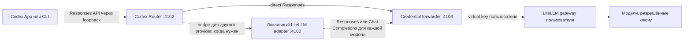

# Подключение собственного LiteLLM gateway

[English](LITELLM-GATEWAY.md) | [Русский](LITELLM-GATEWAY.ru.md)

Это руководство описывает провайдер `litellm-gateway`: переносимое подключение
Codex Router к OpenAI-совместимому LiteLLM, которым управляет сам пользователь.
В репозитории нет общего адреса сервера, virtual key или предустановленного
списка моделей.

## Что и где запускается

Codex Router работает локально на Mac, Windows PC или Linux-компьютере
пользователя. Он ничего не устанавливает на сервер LiteLLM и не требует
изменений исходного кода Codex.



Responses-native модели из **Your LiteLLM Gateway** Router отправляет прямо на
Responses endpoint gateway. Chat Completions модели идут через локальный
adapter, который сохраняет корректный перевод инструментов и истории Codex.
Router запускает adapter, когда он нужен хотя бы одной выбранной модели, и
использует для каждой модели объявленный OpenAI-compatible surface.
Credential forwarder удаляет заголовки идентификации Codex и ChatGPT, добавляет
только выбранный LiteLLM virtual key и отправляет запрос по сохранённому
upstream URL. Нативные GPT-модели обходят внешний маршрут и продолжают работать
через обычный Codex backend.

## Интерактивная установка

Запустите guided installer и выберите **Your LiteLLM Gateway**.

macOS или Linux:

```sh
./install.sh --target codex --guided
```

Windows PowerShell:

```powershell
powershell.exe -NoProfile -ExecutionPolicy Bypass -File .\install.ps1 -Target codex -Guided -Providers litellm-gateway
```

Аргумент провайдера пропускает общее меню, но не передаёт endpoint. Оба
значения оператор всё равно вводит локально. В публичном установщике нет
зашитого URL конкретного gateway.

Установщик последовательно запросит:

1. **OpenAI-compatible base URL** — видимый ввод, например
   `https://gateway.example/v1`. Enter принимает текущее значение. Адрес по
   умолчанию для локального LiteLLM: `http://127.0.0.1:4000/v1`.
2. **LiteLLM virtual key** — скрытый ввод. Ключ нельзя передать аргументом
   команды, и после ввода он не печатается. В Windows после вставки не видно
   ни символов, ни звёздочек: используйте правый клик, Shift+Insert или
   Ctrl+Shift+V в Windows Terminal, затем нажмите Enter.

При установке/старте router автоматически обнаруживает доступные сохранённому
ключу модели и публикует новые ID с осторожными локальными metadata.
Достоверные `max_input_tokens` и `max_output_tokens` из LiteLLM кэшируются
и применяются ко всем встроенным, ручным и auto-curated моделям этого
provider. Входной лимит становится context window Codex, auto-compaction
начинается на 85%, а 131072 остаётся только fallback при отсутствии live-лимита. Команды
ниже остаются полезными для просмотра, ручной настройки metadata и исправления
маршрута:

```sh
./bin/model-router codex discover-models litellm-gateway
./bin/model-router codex curate-models litellm-gateway
./bin/model-router codex doctor
```

На Windows используются те же команды через PowerShell wrapper:

```powershell
.\model-router.cmd codex discover-models litellm-gateway
.\model-router.cmd codex curate-models litellm-gateway
.\model-router.cmd codex doctor
```

После изменения списка моделей полностью закройте и снова откройте Codex, чтобы
он перечитал сгенерированный каталог.

Безопасный default для универсального провайдера — Chat Completions;
проверенный prefix `codex-gpt-` автоматически выбирает Responses. Если другой
alias LiteLLM требует Responses endpoint, задайте маршрут явно:

```sh
./bin/curate-models litellm-gateway --models MODEL_ID --api-surface responses --apply
```

Команда также исправляет существующую auto-curated запись без потери вручную
изменённых metadata. Для обратного переключения используйте
`--api-surface chat-completions`.

## Локальное состояние и приоритет настроек

В репозитории хранится только безопасный loopback-адрес по умолчанию.
Настройки конкретного компьютера находятся в пользовательском каталоге Codex:
обычно `~/.codex/codex-router` на macOS/Linux и
`%USERPROFILE%\.codex\codex-router` на Windows.

| Значение | Файл | Защита | Приоритет во время работы |
| --- | --- | --- | --- |
| URL gateway | `provider-endpoints.json` | mode `600` или Windows ACL текущего пользователя | environment, сохранённое значение, default из registry |
| Virtual key | `litellm-gateway-api-key.secret` | mode `600` или Windows ACL текущего пользователя | environment, защищённый файл, совместимая запись Keychain |
| Выбранные модели | `user-models.json` | mode `600` или Windows ACL текущего пользователя | объединяются с registry репозитория |
| Включённые провайдеры | `enabled-providers.json` | защищённое локальное состояние | проверяются при каждом routed request |

`CODEX_ROUTER_LITELLM_BASE_URL` и `CODEX_ROUTER_LITELLM_API_KEY` подходят для
временной проверки в foreground-процессе. Нельзя рассчитывать, что переменные
текущего терминала попадут в launchd, systemd или Windows Task Scheduler;
для постоянной установки используйте интерактивные команды.

Проверить или изменить подключение без переустановки:

```sh
./bin/model-router codex provider-endpoint litellm-gateway status
./bin/model-router codex provider-endpoint litellm-gateway set
./bin/model-router codex provider-key litellm-gateway status
./bin/model-router codex provider-key litellm-gateway set
```

Forwarder заново разрешает сохранённые URL и ключ при каждом запросе, поэтому
их замена не требует перезапуска сервиса. Перезапуск Codex нужен только после
изменения каталога моделей.

## Политика на стороне LiteLLM

Создавайте отдельный virtual key для каждого человека или компьютера. Ограничьте
его нужными model aliases и задайте небольшой бюджет, requests-per-minute и
лимит параллельных запросов. Никогда не раздавайте LiteLLM master key или
administrator key.

Discovery видит только те модели, которые возвращает gateway для данного
ключа. `litellm-gateway` явно помечен как доверенный provider под управлением
оператора, поэтому проверяет live catalog при установке/старте и затем раз в
пять минут. Фоновый запрос использует сохранённый restricted key, а не
временную переменную окружения.

Новые ID добавляются в защищённый `user-models.json` с defaults: только text,
context 131072, effort `high`, без неподтверждённых vision, search, reasoning
summary и `apply_patch`. Для этого доверенного opt-in provider успешно
разобранный live `/models` snapshot authoritative только для записей с
`autoCurated: true`: отсутствующие ID удаляются из local overlay. Ручные записи
и checked-in registry models сохраняются; валидные live token limits имеют
приоритет только для размеров окна. Ошибка discovery/публикации, non-2xx или
невалидный model list оставляет последние рабочие routes и picker catalog.

После добавления ID supervisor перезапускает только локальный router stack и
публикует сначала gateway routes, затем picker catalog. Если процесс оборвался,
durable pending marker повторит его при следующем старте. Codex Desktop всё
равно нужно полностью закрыть и открыть, чтобы перечитать picker. Периодический
опрос отключается через `MODEL_ROUTER_AUTO_CURATE_INTERVAL_MS=0`; другое
значение должно быть целым числом не меньше `60000` мс. Startup discovery и
ручной curate остаются доступны.

Изменение сохранённого файла virtual key или сохранённого gateway endpoint во
время работы supervisor запускает один немедленный discovery после debounce, а
при изменении catalog использует обычный pending-marker/restart путь
публикации. Watcher фильтрует только эти два файла; недоступный или ошибочный
filesystem watcher не меняет работающие service и catalog, а periodic discovery
остаётся fallback.

## Обновление, rollback и ветки

`main` — переносимая версия для всех пользователей. В ней не должно быть
личного URL gateway, ключа или внутренних model definitions. Персональная beta
с приватными provider metadata должна находиться в отдельном приватном
репозитории: видимость GitHub задаётся всему репозиторию, поэтому ветка внутри
публичного репозитория не может оставаться приватной.

Обновление установленной версии:

```sh
./bin/model-router codex update
./bin/model-router codex doctor
```

Если новая версия не проходит install gates, updater возвращает предыдущую
ревизию. Пока сохранена предыдущая ревизия, оператор также может выполнить
`./bin/rollback` или `.\model-router.cmd codex rollback` на Windows. Update и repair
используют тот же transactional порядок публикации, что и installer. При
ошибке generation, service startup или health check возвращаются предыдущие
managed files и service definition. После успешного обновления picker полностью
закройте и снова откройте Codex.

## Проверка и диагностика

Начните с:

```sh
./bin/model-router codex provider-endpoint litellm-gateway status
./bin/model-router codex provider-key litellm-gateway status
./bin/model-router codex discover-models litellm-gateway
./bin/model-router codex doctor
```

- `401` обычно означает неверный, истёкший или не принятый gateway virtual key.
- `403` обычно означает, что ключ распознан, но не имеет доступа к модели.
- Пустой picker при успешном подключении означает, что startup discovery ещё
  не опубликовал модели; проверьте `discover-models`, при необходимости
  выполните `curate-models` и перезапустите Codex.
- Ошибка соединения обычно означает, что URL недоступен с компьютера
  пользователя или в нём отсутствует ожидаемый deployment префикс `/v1`.
- Модель, отвечающую текстом, но не прошедшую tool test, нельзя продвигать в
  native multi-agent v2 до успешного compatibility probe.

Команда `./bin/support-bundle` создаёт локальный диагностический файл.
Сохранённые custom gateway URL и credentials редактируются, логи по умолчанию
не включаются, автоматической загрузки файла нет. Перед отправкой его всё равно
нужно просмотреть.

## Граница кроссплатформенной поддержки

Node tests и синтаксис установщиков проверяются CI на macOS, Ubuntu и Windows.
На Windows CI также разбирает настоящий PowerShell installer и wrapper и
собирает desktop tray binary. Реальная установка коллегой остаётся release
acceptance test для поведения Codex Desktop на Windows, локального firewall и
доступа к настоящему LiteLLM gateway.
