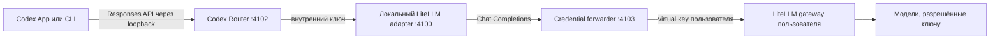

# Подключение собственного LiteLLM gateway

[English](LITELLM-GATEWAY.md) | [Русский](LITELLM-GATEWAY.ru.md)

Это руководство описывает провайдер `litellm-gateway`: переносимое подключение
Codex Router к OpenAI-совместимому LiteLLM, которым управляет сам пользователь.
В репозитории нет общего адреса сервера, virtual key или предустановленного
списка моделей.

## Что и где запускается

Codex Router работает локально на Mac, Windows PC или Linux-компьютере
пользователя. Он ничего не устанавливает на сервер LiteLLM и не требует
изменений исходного кода Codex.



Локальный adapter преобразует запросы и потоки Codex Responses в
OpenAI-совместимый Chat Completions. Credential forwarder удаляет заголовки
идентификации Codex и ChatGPT, добавляет только выбранный LiteLLM virtual key и
отправляет запрос по сохранённому upstream URL. Нативные GPT-модели обходят
этот маршрут и продолжают работать через обычный Codex backend.

## Интерактивная установка

Запустите guided installer и выберите **Your LiteLLM Gateway**.

macOS или Linux:

```sh
./install.sh --target codex --guided
```

Windows PowerShell:

```powershell
./install.ps1 -Target codex -Guided
```

Установщик последовательно запросит:

1. **OpenAI-compatible base URL** — видимый ввод, например
   `https://gateway.example/v1`. Enter принимает текущее значение. Адрес по
   умолчанию для локального LiteLLM: `http://127.0.0.1:4000/v1`.
2. **LiteLLM virtual key** — скрытый ввод. Ключ нельзя передать аргументом
   команды, и после ввода он не печатается.

После установки получите список доступных ключу моделей и выберите те, которые
должны появиться в Codex:

```sh
./bin/model-router codex discover-models litellm-gateway
./bin/model-router codex curate-models litellm-gateway
./bin/model-router codex doctor
```

На Windows используются те же команды через PowerShell wrapper:

```powershell
./model-router.ps1 codex discover-models litellm-gateway
./model-router.ps1 codex curate-models litellm-gateway
./model-router.ps1 codex doctor
```

После изменения списка моделей полностью закройте и снова откройте Codex, чтобы
он перечитал сгенерированный каталог.

## Локальное состояние и приоритет настроек

В репозитории хранится только безопасный loopback-адрес по умолчанию.
Настройки конкретного компьютера находятся в пользовательском каталоге Codex:
обычно `~/.codex/codex-router` на macOS/Linux и
`%USERPROFILE%\.codex\codex-router` на Windows.

| Значение | Файл | Защита | Приоритет во время работы |
| --- | --- | --- | --- |
| URL gateway | `provider-endpoints.json` | mode `600` или Windows ACL текущего пользователя | environment, сохранённое значение, default из registry |
| Virtual key | `litellm-gateway-api-key.secret` | mode `600` или Windows ACL текущего пользователя | environment, защищённый файл, совместимая запись Keychain |
| Выбранные модели | `user-models.json` | mode `600` или Windows ACL текущего пользователя | объединяются с registry репозитория |
| Включённые провайдеры | `enabled-providers.json` | защищённое локальное состояние | проверяются при каждом routed request |

`CODEX_ROUTER_LITELLM_BASE_URL` и `CODEX_ROUTER_LITELLM_API_KEY` подходят для
временной проверки в foreground-процессе. Нельзя рассчитывать, что переменные
текущего терминала попадут в launchd, systemd или Windows Task Scheduler;
для постоянной установки используйте интерактивные команды.

Проверить или изменить подключение без переустановки:

```sh
./bin/model-router codex provider-endpoint litellm-gateway status
./bin/model-router codex provider-endpoint litellm-gateway set
./bin/model-router codex provider-key litellm-gateway status
./bin/model-router codex provider-key litellm-gateway set
```

Forwarder заново разрешает сохранённые URL и ключ при каждом запросе, поэтому
их замена не требует перезапуска сервиса. Перезапуск Codex нужен только после
изменения каталога моделей.

## Политика на стороне LiteLLM

Создавайте отдельный virtual key для каждого человека или компьютера. Ограничьте
его нужными model aliases и задайте небольшой бюджет, requests-per-minute и
лимит параллельных запросов. Никогда не раздавайте LiteLLM master key или
administrator key.

Discovery видит только те модели, которые возвращает gateway для данного
ключа. Curation выполняется локально и явно: обнаруженная модель сама не
публикуется в picker, а модель, выбранная на одном компьютере, не появляется
автоматически на другом.

## Обновление, rollback и ветки

`main` — переносимая версия для всех пользователей. В ней не должно быть
личного URL gateway, ключа или внутренних model definitions. Персональная beta
с приватными provider metadata должна находиться в отдельном приватном
репозитории: видимость GitHub задаётся всему репозиторию, поэтому ветка внутри
публичного репозитория не может оставаться приватной.

Обновление установленной версии:

```sh
./bin/model-router codex update
./bin/model-router codex doctor
```

Если новая версия не проходит install gates, updater возвращает предыдущую
ревизию. Пока сохранена предыдущая ревизия, оператор также может выполнить
`./bin/rollback` или `./codex-router.ps1 rollback` на Windows.

## Проверка и диагностика

Начните с:

```sh
./bin/model-router codex provider-endpoint litellm-gateway status
./bin/model-router codex provider-key litellm-gateway status
./bin/model-router codex discover-models litellm-gateway
./bin/model-router codex doctor
```

- `401` обычно означает неверный, истёкший или не принятый gateway virtual key.
- `403` обычно означает, что ключ распознан, но не имеет доступа к модели.
- Пустой picker при успешном подключении означает, что модели ещё не выбраны;
  выполните `curate-models` и перезапустите Codex.
- Ошибка соединения обычно означает, что URL недоступен с компьютера
  пользователя или в нём отсутствует ожидаемый deployment префикс `/v1`.
- Модель, отвечающую текстом, но не прошедшую tool test, нельзя продвигать в
  native multi-agent v2 до успешного compatibility probe.

Команда `./bin/support-bundle` создаёт локальный диагностический файл.
Сохранённые custom gateway URL и credentials редактируются, логи по умолчанию
не включаются, автоматической загрузки файла нет. Перед отправкой его всё равно
нужно просмотреть.

## Граница кроссплатформенной поддержки

Node tests и синтаксис установщиков проверяются CI на macOS, Ubuntu и Windows.
На Windows CI также разбирает настоящий PowerShell installer и wrapper и
собирает desktop tray binary. Реальная установка коллегой остаётся release
acceptance test для поведения Codex Desktop на Windows, локального firewall и
доступа к настоящему LiteLLM gateway.
